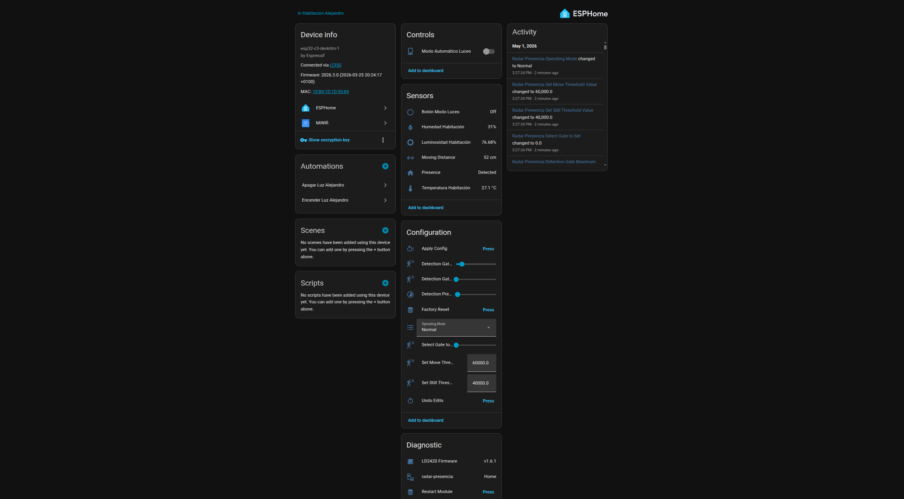

# DIY Presence Radar with ESP32-C3 & LD2420

<p align="center">
  
  
  
</p>

<p align="center">
  <em>[PHOTO: hero-assembled.jpg] — A clean photo of the fully assembled device</em>
</p>

---

## Features

- **mmWave presence detection** with distance measurement (LD2420)
- **Temperature & humidity monitoring** (DHT11)
- **Ambient light sensing** (LDR)
- **Physical button** for toggling automations
- **Configurable detection zones** (gate distance, thresholds) via Home Assistant
- **Automatic mode toggle** for light automations
- **WiFi with fallback** captive portal hotspot
- **OTA updates** support
- **Full Home Assistant integration** via native API

---

## Components / BOM

| Component | Quantity | Notes |
|-----------|----------|-------|
| ESP32-C3 (esp32-c3-devkitm-1) | 1 | Development board |
| LD2420 mmWave Radar | 1 | UART presence sensor |
| DHT11 | 1 | Temperature & humidity |
| LDR (Photoresistor) | 1 | Ambient light sensing |
| Resistor 10kΩ | 2 | Voltage divider for LDR + button pull-down |
| Tactile button | 1 | Mode toggle |
| M2 Screws | 4 | Case assembly |
| 3D printed case | 1 | Custom enclosure |

---

## Wiring / Pinout

| GPIO Pin | Component | Function | Notes |
|----------|-----------|----------|-------|
| GPIO0 | LD2420 | UART TX | 115200 baud |
| GPIO1 | LD2420 | UART RX | 115200 baud |
| GPIO3 | LDR | ADC (Analog) | Voltage divider with 10kΩ, auto attenuation |
| GPIO5 | DHT11 | Digital data | Single-wire protocol |
| GPIO7 | Tactile button | Digital input | INPUT_PULLUP, inverted, 50ms debounce |

> **Note:** Wiring diagram photo: `[PHOTO: wiring-diagram.jpg]` — Clear photo or Fritzing diagram showing all connections

---

## Assembly Instructions

1. **Wire the components** per the pinout table  
   `[PHOTO: wiring-closeup.jpg]` — Close-up of soldered or breadboard connections

2. **Place electronics inside** the 3D printed case  
   `[PHOTO: internals-case.jpg]` — Board and sensors fitted inside the enclosure

3. **Secure with 4x M2 screws**  
   `[PHOTO: screws-detail.jpg]` — Detail of screws tightening the case halves

4. **Final assembled unit**  
   `[PHOTO: final-assembled.jpg]` — Completed device ready for mounting

---

## 3D Printed Case

STL files for the custom enclosure can be found in the [`3d-print/`](./3d-print/) folder.

### Recommended Print Settings

- **Filament:** PLA or PETG
- **Layer height:** 0.2 mm
- **Infill:** 20%
- **Supports:** Yes (for screw bosses)

**Photo placeholders:**
- `[PHOTO: 3d-print-case.jpg]` — Photo of the empty printed case
- `[PHOTO: 3d-print-exploded.jpg]` — Exploded view showing all parts

---

## ESPHome Configuration

The full ESPHome configuration is available at [`esphome/radar-presencia.yaml`](./esphome/radar-presencia.yaml).

### Key Configuration Sections

- **UART setup:** Configures GPIO0/GPIO1 for LD2420 communication at 115200 baud
- **LD2420 integration:** Full sensor and control entity setup via the ESPHome LD2420 component
- **Sensors:** DHT11 (temperature/humidity), ADC (LDR light level), LD2420 (distance)
- **Automations:** Physical button toggles the "Modo Automático Luces" switch

> **Note:** WiFi credentials and sensitive keys (API encryption, OTA password) are stored in your ESPHome `secrets.yaml` file. See [ESPHome Secrets](https://esphome.io/guides/faq.html#how-do-i-use-secrets) for details.

---

## Home Assistant Integration

Once the device is connected to your network and adopted into Home Assistant, the following entities will appear:

### Binary Sensors
- **Presence** — `binary_sensor.radar_presencia_presence`
- **Physical Button** — `binary_sensor.radar_presencia_boton_modo_luces`

### Sensors
- **Moving Distance** — `sensor.radar_presencia_moving_distance`
- **Temperature** — `sensor.radar_presencia_temperatura_habitacion`
- **Humidity** — `sensor.radar_presencia_humedad_habitacion`
- **Light Level** — `sensor.radar_presencia_luminosidad_habitacion` (%)

### Controls (Numbers / Selects)
- **Operating Mode** — `select.radar_presencia_operating_mode`
- **Detection Presence Timeout** — `number.radar_presencia_detection_presence_timeout`
- **Detection Gate Minimum** — `number.radar_presencia_detection_gate_minimum`
- **Detection Gate Maximum** — `number.radar_presencia_detection_gate_maximum`
- **Gate Select** — `number.radar_presencia_select_gate_to_set`
- **Still Threshold** — `number.radar_presencia_set_still_threshold_value`
- **Move Threshold** — `number.radar_presencia_set_move_threshold_value`

### Switch
- **Automatic Light Mode** — `switch.radar_presencia_modo_automatico_luces`

### Buttons
- **Apply Config** — `button.radar_presencia_apply_config`
- **Factory Reset** — `button.radar_presencia_factory_reset`
- **Restart Module** — `button.radar_presencia_restart_module`
- **Undo Edits** — `button.radar_presencia_undo_edits`

### Text Sensor
- **LD2420 Firmware** — `text_sensor.radar_presencia_ld2420_firmware`

**Home Assistant dashboard showing all entities:**  


---

## Automation Ideas

Here are a few Home Assistant automations to get you started:

### 1. Turn on lights when presence detected

Trigger lights when someone is present, the room is dark, and auto-mode is enabled:

```yaml
automation:
  - alias: "Luces automáticas con radar"
    trigger:
      - platform: state
        entity_id: binary_sensor.radar_presencia_presence
        to: "on"
    condition:
      - condition: numeric_state
        entity_id: sensor.radar_presencia_luminosidad_habitacion
        below: 30
      - condition: state
        entity_id: switch.radar_presencia_modo_automatico_luces
        state: "on"
    action:
      - service: light.turn_on
        target:
          entity_id: light.habitacion
```

### 2. Temperature / humidity alert

Send a notification if temperature or humidity exceeds safe thresholds:

```yaml
automation:
  - alias: "Alerta temperatura alta"
    trigger:
      - platform: numeric_state
        entity_id: sensor.radar_presencia_temperatura_habitacion
        above: 30
    action:
      - service: notify.mobile_app_telefono
        data:
          message: "Temperatura alta detectada: {{ trigger.to_state.state }}°C"
```

### 3. Toggle auto mode with physical button

The physical button is already configured in the ESPHome YAML to toggle the auto-mode switch. You can extend this in Home Assistant to send a confirmation notification or flash a light:

```yaml
automation:
  - alias: "Notificar cambio de modo"
    trigger:
      - platform: state
        entity_id: switch.radar_presencia_modo_automatico_luces
    action:
      - service: notify.mobile_app_telefono
        data:
          message: "Modo automático {{ 'activado' if trigger.to_state.state == 'on' else 'desactivado' }}"
```

---

## Flashing Instructions

1. **Install ESPHome**
   - Via Home Assistant add-on: *Settings > Add-ons > ESPHome Device Builder*
   - Or via CLI: `pip install esphome`

2. **Connect the ESP32-C3** via USB to your computer

3. **Flash the configuration**
   ```bash
   esphome run esphome/radar-presencia.yaml
   ```
   Or use the ESPHome dashboard to adopt and flash the device.

4. **Connect to WiFi**
   - The device will attempt to connect to the WiFi network defined in your `secrets.yaml`
   - If it fails, a fallback hotspot named `Radar-Presencia Fallback Hotspot` will appear

5. **Adopt in Home Assistant**
   - Go to *Settings > Devices & Services > ESPHome*
   - The device should appear automatically for adoption

---

## Troubleshooting

| Issue | Solution |
|-------|----------|
| LD2420 not detected | Check UART wiring (GPIO0/GPIO1) and verify baud rate is 115200 |
| DHT11 reading NaN | Verify GPIO5 connection and ensure 3.3V power is stable |
| LDR always 0% or 100% | Check voltage divider wiring on GPIO3; ensure 10kΩ resistor is in place |
| WiFi not connecting | Verify `secrets.yaml` contains correct `wifi_ssid` and `wifi_password` |
| OTA updates fail | Ensure the device and Home Assistant are on the same network |

---

## Contributing

Contributions are welcome! Feel free to open an issue or submit a pull request if you have improvements, bug fixes, or new features. Whether it's better 3D models, additional sensors, or documentation improvements — all PRs are appreciated.

---

## Credits

- **ESPHome** — [esphome.io](https://esphome.io)
- **LD2420 Component** — ESPHome community LD2420 integration
- **Home Assistant** — [home-assistant.io](https://www.home-assistant.io)

---

## License

This project is licensed under the MIT License. See the [LICENSE](LICENSE) file for details.

<p align="center">
  
</p>
